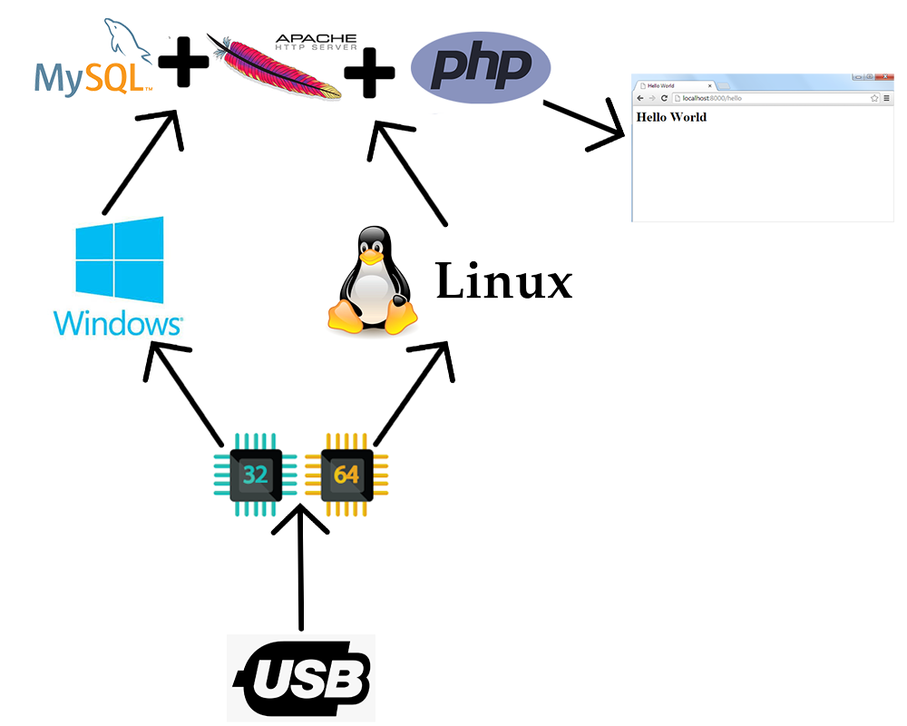

# APM_server
The program is ready to work in any working environment, Windows or Linux, with their versions x64 and x86. You can put it on your usb, navigate with it, and work with it on any computer.


<div align="center">
        <br>
</div>

<div align="center">
        <br>
</div>


<div align="center">
        <a href=""></a>
</div>


### Languages :
* bach (.sh soon).
* batch (.bat).

### System :
* Linux (soon)
* windows

# Requirements
For windows:
[✓] nothing.<br>

For linux:
[✓] soon...<br>


# Usage
## For windows:
[✓] Download this script.<br>
[✓] Download 'Apache' + 'Php' + 'Mysql' + 'PhpMyAdmin' packages.<br>
[✓] extract the packages 'Apache' + 'Php' + 'Mysql' in {if you use windwos in 'server\windows\(x64 or x86 Depend on your usage).'}. <br>
[✓] Edit file 'settings.txt'. <br>
---- line 1 - empty. <br>
---- line 2 - server folder name (DocumentRoot) for example 'www'. <br>
---- line 3 - Apache folder name. <br>
---- line 4 - php folder name. <br>
---- line 5 - php version (for example '7.4.8'). <br>
---- line 6 - .dll file used(for example php 7 and apache 2.4 = 'php7apache2_4.dll'). <br>
---- line 7 - mysql folder name. <br>
---- line 8 - databases folder name. <br>
[✓] extract the package 'PhpMyAdmin' in your DocumentRoot for example 'www'. <br>
[✓] Run 'win_start.hta'. <br>
[✓] In the case of first use : click 'First use' button. <br>
[✓] If you change the USB port OR Changing the server file, press 'config' of Apache, php. <br>
[✓] If you change the database file name, press the button 'config' of mysql. <br>
[✓] To run what you want, press 'Start'. <br>

# Download 
windows:
----
Apache
http://www.apachelounge.com/download/

Apache 2.4.46 Win64
https://www.apachelounge.com/download/VS16/binaries/httpd-2.4.46-win64-VS16.zip

Apache 2.4.46 Win32
https://www.apachelounge.com/download/VS16/binaries/httpd-2.4.46-win32-VS16.zip

----
Php
http://www.php.net/downloads.php

VC15 x64 Thread Safe (2020-Aug-04 15:17:50)
https://windows.php.net/downloads/releases/php-7.4.9-Win32-vc15-x64.zip

VC15 x86 Thread Safe (2020-Aug-04 15:17:57)
https://windows.php.net/downloads/releases/php-7.4.9-Win32-vc15-x86.zip

----
phpmyadmin
https://www.phpmyadmin.net/downloads/

phpMyAdmin 5.0.2
https://files.phpmyadmin.net/phpMyAdmin/5.0.2/phpMyAdmin-5.0.2-all-languages.zip

----
mysql
http://dev.mysql.com/downloads/
https://dev.mysql.com/downloads/mysql/

Mysql (x86, 64-bit)
https://dev.mysql.com/get/Downloads/MySQL-8.0/mysql-8.0.21-winx64.zip

-------------------
linux:
Soon...

# SUPPORTED DISTRIBUTIONS
|Distribution | Version Check | supported | status |Everything works|
----------|-------|------|-------|-------|
|Kali Linux|2020.1 | soon | soon   | soon|
|windwos|10,8,7 | yes | working   |yes|

## Release History
```
- Version 1.20.2 [08-08-2020]
...
```


### Contact :
##### Mail : by.root96@gmail.com


[](https://money.yandex.ru/to/410018413831485)

Bitcoin: 39zpRApjkLn1ARjiikKXNAu1Z4gGZGvNLT

Dogecoin: DKTmN8QhbBp2Q9L9ya4VWFNjG8qLNpkUMN


## License
Copyright (C) 2010 - 2020 [byRo0t96](https://byro0t96.github.io/)

<div align="center">
        <a href="https://byro0t96.github.io/"></a>
</div>

